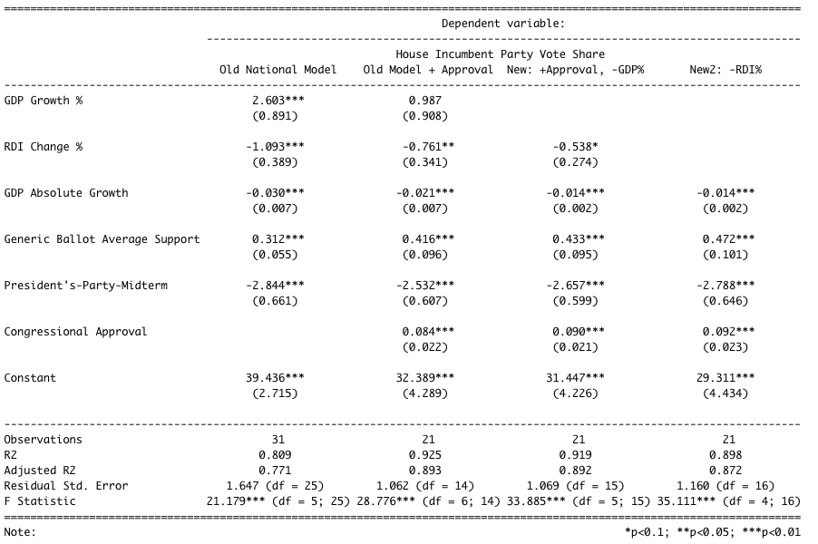
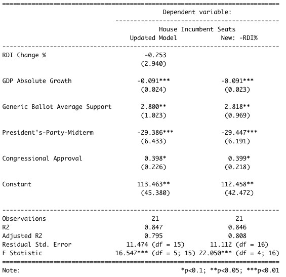
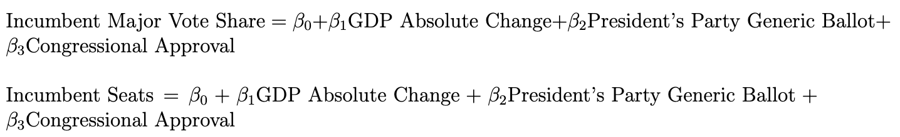

This is blog post #7 in a series of analytical posts in lieu of the 2022 midterms. This post is affiliated with Gov 1347: Election Analytics, a course at Harvard University in the department of Government.

---
```{r setup, include = FALSE, message = FALSE}
# Set up
knitr::opts_chunk$set(echo = TRUE)
library(tidyverse)
library(janitor)
library(readr)
library(stargazer)
library(usmap)
library(rmapshaper)
library(sf)
library(insight)
library(scales)

expert_ratings <- read_csv("expert_rating.csv")
historical_results <- read_csv("historical_results.csv")
nat_results <- read_csv("nat_seats.csv")
national_data <- read_csv("econ_mid_genball_results.csv")
d2022 <- read_csv("house_cands.csv")
roger <- read_csv("cong_polls.csv") %>%
  mutate(end = substr(EndDate, nchar(EndDate) - 2 + 1, nchar(EndDate))) %>%
  mutate(Year = case_when(end <= 22 ~ as.numeric(paste0("20", end)), T ~ as.numeric(paste0("19", end)))) %>%
  mutate(year = case_when(Year %% 2 == TRUE ~ Year+1, T ~ Year))

roger$RespPct <- as.numeric(roger$RespPct)

cong_approval <- roger %>%
  group_by(year, RespTxt) %>%
  filter(RespTxt == "Approve") %>%
  summarize(cong_approv = mean(RespPct, na.rm = TRUE))

roger %>%
  filter(year == 2022, RespTxt == "Approve") %>%
  summarize(avg = mean(RespPct, na.rm = TRUE))
```

# The Plan This Week
Election Day is about two weeks out! So far, I've investigated the fundamentals (president's-party-midterm effect, the economy, incumbency), the campaigns (air war, ground game), and experts (their forecasts) as predictors of election outcomes to determine if I should incorporate them as variables in my own election model. I've found each group to be predictive, not very predictive, and impressively predictive, respectively, and have updated my model and forecasts accordingly. This week, I will briefly examine the academic research regarding the factor that, by definition, is overlooked by all of the aforementioned typical election variables -- shocks. After that, I will update my district-level and national models, and present my newest predictions. 

# Shocks
In 2016, Achen and Bartels argued that voters are retrospective, but not with adequate levels of nuance. When they perceive downturn or misfortune, they punish incumbents -- regardless of the incumbents' actual ability to prevent or control the hardship. Their argument in Chapter 5 of "Democracy for Realists" features several infamous examples of electoral shocks, such as the shark attacks of 1916 in New Jersey, as well as 20th Century droughts and floods. The latter "seem to rule out the possibility that [voters] were reacting to subpar *handling* of misfortunes rather than to the misfortunes themselves." They go on to argue that this type of "blind retrospection," in which voters punish incumbents for negative shocks, is a bad sign for voter competence, thus, bad for democracy.      

```{r echo = FALSE, fig.cap = 'The Philadelphia Inquirer Reports on the Shark Attacks in Ocean County, NJ.'}

```
In 2018, Harvard Government graduate students Fowler and Hall re-examined the prominent claims made by Achen and Bartels. Interestingly, they find that there is "no systematic evidence that shark attacks affect elections." If there is any such effect, it is essentially negligible. The most important part of their research for me was their commentary on the difficulty of studying of shocks and irrational behavior: "We have no way of knowing how many other irrelevant factors were examined and found to have no effect." In my own attempts to understand the correlation between specific shocks and voter registration rates, or electoral outcomes, I have found myself wondering what marks the difference between my own hypothesis about one shock and the innumerable variations of it, or of other shocks, within the same election cycle. There are so many "shocks" every election cycle that it would be a shock in and of itself to have none. So to study them, and try to determine which one, if any, has been the game-changer moment of an election has turned out to be an incredibly hard task.  

Aviña and Sevi were able to study perhaps the biggest shock of the 2020 race -- COVID-19 -- and found that Trump's vote share decreased because some voters punished him for their exposure to the virus, but "there is no evidence suggested that Joe Biden loses the election when no voter reports exposure to coronavirus cases and deaths." The researchers dub the effect of COVID-19 exposure negligible, stating that "our counterfactual analysis shows that the presidential two-party vote is virtually unchanged when no voter contracts the disease" (2021). Previous studies found voters supported Trump more, comparatively, in areas most negatively affected by the pandemic (McMinn and Stein, 2020), giving credence to the idea that while some shocks may push voters one way, other factors push them or other voters back. In tandem, these forces make the effects of individual shocks hard to isolate, and appear generally negligible.  

The above has led me to decide to use shocks as an expectation-setter, but not as a formal variable in my model. For many Democrats, the Supreme Court's ruling on the Dobbs case in late June was a shock that ran antithetical to the party's reproductive rights platform and reinvigorated their fight for congressional control. As discussed, it would be difficult and time-inefficient to try to isolate the effect of the Dobbs ruling on this election's outcomes. Instead, that case, and the other "shocks" of this election cycle, give us a sense of what to expect voters to react to. To incorporate these reactions into my model, I opt to consider more solid measures that encapsulate shocks, such as the generic ballot in my national model, which reflects the electoral mood of voters, all things considered. For my district-level model for the House, I move from using just expert predictions (which consider shocks already) to including incumbency as well, as it's known that incumbents win re-election in the House at an incredibly high rate, shocks or not.       

# My 2022 Model and Forecast, Updated
There are many updates to be made to my national and district-level models. I decided to not do any pooled models because I wanted to try an ensembling idea instead - have models for competitive districts (expert predictions + incumbency) and non-competitive ones (just incumbency + perhaps just a few experts' predictions since not all of them predict the less competitive races). 

## Models
```{r competitive district models with incumbency and expert rating, include = FALSE, message = FALSE}
# preparing districts for joining
expert_ratings$district <- as.numeric(expert_ratings$district)
historical_results$district <- as.numeric(historical_results$district)

avg_ratings <- expert_ratings %>% 
  select(year, state, district, avg_rating)

historical_results <- historical_results %>% 
  mutate(incumbent = case_when(DemStatus == "Incumbent" ~ 1, T ~ 0), demWin = case_when(WinnerParty == "D" ~ 1, T ~ 0), open = case_when((DemStatus == "Challenger" & RepStatus == "Challenger") ~ 1, T ~ 0))

# Joining the data and nesting by state and district
train_data <- avg_ratings %>% 
  filter(year != 2022) %>% 
  # left join as there aren't ratings for every district
  left_join(historical_results, by = c("year", "state", "district"))  %>%
  group_by(state, district) %>% 
  filter(n() > 1) %>% # Filtering out single data rows
  group_nest() %>% 
  mutate(data = map(data, ~unnest(., cols = c())))

d2022$district <- as.numeric(d2022$district )
d2022 <- d2022 %>%
  filter(cand_party == "Democratic") %>%
  distinct()

test_data <- avg_ratings %>% 
  left_join(d2022, by = c("state", "district")) %>%
  filter(year == 2022) %>% 
  group_by(state, district) %>% 
  group_nest() %>% 
  mutate(data = map(data, ~unnest(., cols = c())))

# Building TERRIBLE models
models <- train_data %>% 
  mutate(model = map(data, ~lm(dem_votes_major_percent ~ avg_rating + incumbent, 
                                  data = .x))) %>% 
  select(-data)

# Extracting TERRIBLE model results
model_results <- models %>% 
  mutate(RS = map_dbl(model, ~summary(.x)$r.squared), ARS = map_dbl(model, ~summary(.x)$adj.r.squared))

# Predicting 2022 with a TERRIBLE model
pred_2022 <- test_data %>%
  # inner join as there may not be historical models for some districts
  inner_join(models, by = c("state", "district")) %>% 
  mutate(pred = map(.x = model, .y = data, ~predict(object = .x, newdata = as.data.frame(.y), interval = 'confidence'))) %>%
  select(state, district, pred)

hist(model_results$RS)
mean(model_results$RS, na.rm = TRUE)
mean(model_results$ARS, na.rm = TRUE)
length(model_results)

pred_2022 <- pred_2022%>%
  unnest_wider(col = pred) %>%
  distinct() %>%
  mutate(winner = case_when(...1 >= 50 ~ "Democrat", T ~ "Republican")) %>%
  select(state, district, ...1, ...3, ...5, winner) %>%
  rename("prediction" = ...1, "lower" = ...3, "upper" = ...5)

d2022
```

### New District Models
The first iteration of my district-level modeling was a recreation of [Yao's](https://itsyaoyu.com/blog/) work, which made use of the averaged expert predictions across subsets of the Cook, Inside Elections, CQ Politics, Sabato's Crystal Ball, Real Clear Politics, FiveThirtyEight, Politico, The Economist, Elections Daily, The Hill, NY Times, Daily Kos, and Decision Desk HQ reports, to predict House race outcomes at the district level. The idea is that these experts all have the time and resources to gain a good feel of the elections, and their wisdom, on average, can help us call elections long before Election Day. This week, I strengthened these base models with an incumbent variable. Because my models are built to predict Democratic major vote share in each district, I encoded the incumbent variable to be 1 when the candidate is both Democrat and the incumbent. 

The result of this variable addition across the 94 models of competitive districts is that the average R-squared jumps from 0.78 to 0.88. The average adjusted R-squared is 0.49. The model is still imperfect, but it's been much improved since its the first version! Hopefully, I can build models for the remaining 341 "non-competitive" districts as well, in time for November 8.    

```{r national models, include = FALSE}
# Predicting Vote Share
cong_approval$year <- as.numeric(cong_approval$year)

nat_model_data <- national_data %>%
  left_join(cong_approval, by = "year") 

nat_model_old <- lm(H_incumbent_party_majorvote_pct ~ GDP_growth_pct + DSPIC_change_pct + GDP_growth_qt + 
               pp_generic_ballot + midterm_pres_party_inc_party, data = nat_model_data)

nat_model_cong <- lm(H_incumbent_party_majorvote_pct ~ GDP_growth_pct + DSPIC_change_pct + GDP_growth_qt + 
               pp_generic_ballot + midterm_pres_party_inc_party + cong_approv, data = nat_model_data)

nat_model <- lm(H_incumbent_party_majorvote_pct ~ DSPIC_change_pct + GDP_growth_qt+ 
               pp_generic_ballot + midterm_pres_party_inc_party + cong_approv, data = nat_model_data)

nat_model2 <- lm(H_incumbent_party_majorvote_pct ~ GDP_growth_qt+ 
               pp_generic_ballot + midterm_pres_party_inc_party + cong_approv, data = nat_model_data)

stargazer(nat_model_old, nat_model_cong, nat_model,nat_model2, type = "text", title = "Week 7 National Models",
          dep.var.labels = "House Incumbent Party Vote Share",
          covariate.labels = c('GDP Growth %', 'RDI Change %', 'GDP Absolute Growth', 'Generic Ballot Average Support', 'President\'s-Party-Midterm', 'Congressional Approval'),
          column.labels = c("Old National Model", "Old Model + Approval", "New: +Approval, -GDP%", "New2: -RDI%"), model.numbers = FALSE)

# Predicting Seats
nat_model_seats <- lm(seats ~ DSPIC_change_pct + GDP_growth_qt + pp_generic_ballot + midterm_pres_party_inc_party + cong_approv, data = nat_model_data)

nat_model_seats2 <- lm(seats ~ GDP_growth_qt + pp_generic_ballot + midterm_pres_party_inc_party + cong_approv, data = nat_model_data)

stargazer(nat_model_seats,nat_model_seats2, type = "text",
          dep.var.labels = "House Incumbent Seats",
          covariate.labels = c('RDI Change %', 'GDP Absolute Growth', 'Generic Ballot Average Support', 'President\'s-Party-Midterm', 'Congressional Approval'),
          column.labels = c("Updated Model", "New: -RDI%"), model.numbers = FALSE)


```
### New National Model
I have also changed my national models a bit this week. I wanted to congressional approval polling data, as I believe that the electorate's opinion of the current Congress is a good indicator of whether or not members of that class will be supported in the upcoming round of elections. To do this, I used [Gallup's congressional approval polls](https://news.gallup.com/poll/1600/congress-public.aspx) dating back to 1980. Below are my regression results for the old national model I had, a new one with congressional approval, and two final options one, with (finally) one of the GDP variables thrown out, and the other with RDI % also thrown out. 


As shown by the difference in adjusted R-squared between the first and second models, adding the congressional approval polls considerably improves the performance of my national model. Though I initially thought that congressional approval was a very similar metric to the generic ballot, it turns out their correlation is only about 0.08, and they separately account for variation in House incumbent vote share. Lastly, I was able to eliminate one of the two GDP variables, which had previously been confusing to interpret. Now, absolute GDP change remains, and its coefficient is negative. My hypothesis is that for GDP, voters respond to levels rather than relative change, so they slightly punish incumbents when growth is not "large enough." Lastly, I now get to decide whether or not to keep the RDI% change variable, considering its exclusion from the model left the model large the same.


The seats model is largely the same as the vote share one, and here, it is more apparent that excluding the RDI % variable is a good decision, decreasing the complexity of the regression whilst keeping its performance high.
```{r correlation, include = FALSE}
cor(nat_model_data$cong_approv[17:31], nat_model_data$pp_generic_ballot[17:31])
```

## Forecasts
See below for my new district-level and national predictions. 

### New District Forecasts
The 94 most competitive districts I had election expert ratings for: 
```{r 94 district predictions printout, echo = FALSE}

export_table(pred_2022, format = "html")

```

### New National Forecast

I elect to exclude RDI % as a variable for my national models now, so these predictions are made using the newest GDP, generic ballot, and congressional approval data. 

House Incumbent (Democratic Party) Two-Party Vote Share: **48.56** (47.36, 49.83) 
House Incumbent (Democratic Party) Seats: **209** (198, 221) 
```{r national model prediction, include = FALSE}
# Prediction
data2022 <- data.frame(126, 45.5, TRUE, 25.38462)
colnames(data2022) <- c("GDP_growth_qt", "pp_generic_ballot", "midterm_pres_party_inc_party", "cong_approv")

predict(nat_model2, data2022, interval = "confidence")
predict(nat_model_seats2, data2022, interval = "confidence")

```

---
**References**

[1] Achen, & Bartels, L. M. (2016). Democracy for Realists: Why Elections do not Produce Responsive Government. Princeton University Press.

[2] Fowler, & Hall, A. B. (2018). Do Shark Attacks Influence Presidential Elections? Reassessing a Prominent Finding on Voter Competence. The Journal of Politics, 80(4), 1423–1437. https://doi.org/10.1086/699244

[3] Mendoza Aviña, & Sevi, S. (2021). Did exposure to COVID-19 affect vote choice in the 2020 presidential election? Research & Politics, 8(3), 205316802110415. https://doi.org/10.1177/20531680211041505


