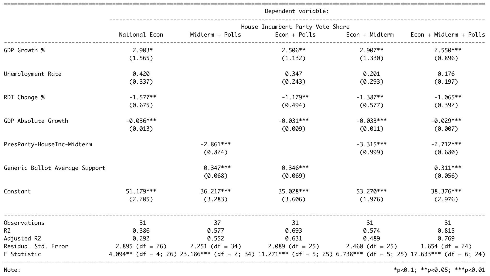

This is blog post #3 in a series of analytical posts in lieu of the 2022 midterms. This post is affiliated with Gov 1347: Election Analytics, a course at Harvard University in the department of Government.

---

```{r setup, include=FALSE}

## Set up

knitr::opts_chunk$set(echo = TRUE)
library(tidyverse)
library(readr)
library(stargazer)

generic_2022 <- read_csv('538_generic_poll_2022.csv')
generic_2018 <- read_csv('538_generic_poll_2018.csv')
house_results_econ <- read_csv("house_results_econ_vars.csv")
poll_df <- read_csv("GenericPolls1942_2020.csv")

```

```{r}
detailedvotes <- read_csv("inc_pop_vote_df.csv")
df <- detailedvotes %>%
  filter(party== H_incumbent_party)
df <- full_join(df, house_results_econ, by = "year") %>%
  select(-c(...1.x, winner_party.x, H_incumbent_party.x, majorvote_pct, ...1.y, quarter_cycle)) %>% 
  rename('Other seats' = Other_seats.x, 'Total votes' = total_votes.x, H_incumbent_party = H_incumbent_party.y)

```


```{r clean polls and add weighing data, include = FALSE }
polls <- poll_df %>%
  # Filter out election year and discard polls conducted after election
  filter(year %% 2 == 0) %>%
  filter(days_until_election > 0, days_until_election < 365) %>%
  select(year, emonth, eday, dem, rep, days_until_election, sample_size, type) %>%
  rename(dem_poll = dem, rep_poll = rep) %>%
  # add weights
  mutate(recency = (365 - days_until_election)/100, size = (sample_size/30)/100, weight100 = recency + size)
```

```{r weigh polls, include = FALSE}

poll_df_final <- polls %>%
  # calculate weighted average
  group_by(year) %>%
  summarize(dem_poll_weighted = weighted.mean(dem_poll, recency),
            rep_poll_weighted = weighted.mean(rep_poll, recency))

```

```{r final df with econ vars + polls + midterms, include = FALSE}
df <- full_join(df, poll_df_final, by = "year") 
# Calculate polling data for President's party
df <- df %>%
  filter(year >= 1948) %>%
  mutate(pp_generic_ballot = # Two-party vote share of the incumbent President's party
           case_when(H_incumbent_party == "D" ~ dem_poll_weighted,
                     H_incumbent_party == "R" ~ rep_poll_weighted), 
         midterm_pres_party_inc_party = # Midterm election or not
           case_when((year %% 4 == 0) & (H_incumbent_party == president_party) ~ FALSE,
                     (year %% 4 == 0) & (H_incumbent_party != president_party) ~ FALSE,
                     (year %% 4 == 2) & (H_incumbent_party == president_party) ~ TRUE,
                     (year %% 4 == 2) & (H_incumbent_party != president_party) ~ FALSE))
```


## The Plan This Week
So far, I've confirmed that the president’s party often performs poorly in the midterm House elections and that a combination of fundamental (Q8, national) economic variables, including GDP growth %, RDI change %, unemployment rate, and absolute GDP growth, are somewhat able to predict House incumbent party vote share. These two findings have led me to forecast that the incumbent (President and House) Democrats will lose House vote share in November. This week, I delve into how forecasting giants like [The Economist](https://www.economist.com/interactive/us-midterms-2022/forecast/house) and FiveThirtyEight, [(Silver 2022)](https://projects.fivethirtyeight.com/2022-election-forecast/house/) incorporate polls into their House predictions. Then, I examine how polling data can improve my predictions by investigating how predictive it's been in past elections. After that, I will incorporate the latest polls to give a numerical prediction for the Democrat House vote share. 

## What Do Forecasters Do? 
In general, election forecasters gather as much relevant data about elections as they can to predict the outcome of future ones. The prevailing question for them, and for students of government in Election Analytics, pertains to what data is relevant? 

# The Econonmist
According to [The Economist's forecasting model report](https://www.economist.com/the-economist-explains/2022/09/09/how-does-the-economists-midterms-election-model-work) this year, polls are the best indicator for the outcome of House elections. Especially informative is the "generic ballot" question, which asks "If the elections for U.S. Congress were being held today, would you vote for the Republican Party’s candidate or the Democratic Party’s candidate for Congress in your district?" (Pew Research Center, 2002). As the countdown to Election Day dwindles, poll results are weighed more heavily, as they're believed to be more reflective of the electorate than previous polls. Additionally, pollster quality over the years is also considered to correct for past estimation errors. The models also account for a slew of other predictors, including president's party performance in special elections, the midterm-incumbent disadvantage, state-level partisan lean, and campaign finances.

# FiveThirtyEight
FiveThirtyEight has become a renowned forecasting site, and is transparent about its [methodology](https://fivethirtyeight.com/methodology/how-fivethirtyeights-house-and-senate-models-work/). In all versions of their House forecast, they consider thousands of polls (district-level), each weighted with pollster rating and quality in mind. For districts with low or no polling, they use the CANTOR system, which "infers results ... from comparable districts that do have polling." More complex versions of their modeling include the fundamentals (such as economics, fundraising, past elections results), and expert forecasts ([Cook Political Report](https://www.cookpolitical.com/ratings/house-race-ratings), [Inside Elections](https://insideelections.com/ratings/house), and [Sabato's Crystal Ball](https://centerforpolitics.org/crystalball/2022-house/)). 

# Comparison and Insights
For the most part, The Economist and FiveThirtyEight methodologies appear to be similar. On a high level, they share many predictors: polls (weighted according to recency, pollster quality), previous election results, campaign finances, and other fundamentals, like the midterm-incumbent effect. Some small, but important, differences lie in the specifics of each predictor - for example, The Economist relies more on generic ballot polling data, while FiveThirtyEight utilizes district-level candidate polls. FiveThirtyEight includes expert ratings and forecasts in their model, which The Economist does not. 

I personally prefer the FiveThirtyEight model due to its inclusion of expert ratings. Though it seems initially a bit circular to build a predictive model based, in part, on others' predictions, it ultimately makes sense -- other experts have made their best guesses for election results, and on average, they probably are onto something. This idea is reminiscent of Galton's (1907) "wisdom of the crowds," but the crowds consist of pollsters and election forecasters here.  

## My Forecast Updates
I take inspiration from the aforementioned models and update my own, incorporating national economic variables, the midterm-incumbent effect, and generic ballot polling data in order to predict the House incumbent party vote share for the upcoming election. 

The economic variables are the exact same as the ones from last week; see [here](https://vivian-1372.github.io/Election-Analytics/post/2022-09-19-local-and-national-economy/) for more information. The `PresParty-HouseInc-Midterm` variable is meant to capture the midterm-incumbent effect, taking a value of: `1` for election years when there is a midterm election *and* the House incumbent party is the president's party, `0` otherwise. In these years, we'd expect the House incumbent party to suffer in vote share, as it's known that the president's party, which is the same as the House incumbent party, performs poorly in midterm years. The generic ballot poll responses are taken into account via the `Generic Ballot Average Support` variable, which averages the generic ballot responses for each election year with respect to weighting that boost polls closer to Election Day, and dampen those farther out. 

Below is a regression table of several model editions I considered. 

The "National Econ" Model comes from last week, and only considers the national economic variables of Gross Domestic Product growth (percentage and absolute), unemployment rate, and Real Disposable Income (RDI) change %. The adjusted R-squared is only 0.292, and few variables are clearly predictive of vote share. 

Next, I consider a model using only the midterm-incumbent effect and generic ballot support. Impressively, these two variables alone have an adjusted R-squared of 0.552. 

The next two models consider economic variables and either polls, or the midterm-incumbent effect, but not both. It appears that the generic ballot polls provide more predictive power to my model than the midterm effect alone. 

Lastly, my final model considers all the predictors we've conceptually explored up until this point - generic ballot polling data *and* fundamentals like national economic variables and midterm-incumbent effect. My R-squared




```{r regression models and stargazer, warning = FALSE, include = FALSE}
# cor(df$pp_generic_ballot, df$H_incumbent_party_majorvote_pct)

model1 <- lm(H_incumbent_party_majorvote_pct ~ GDP_growth_pct + UNRATE + DSPIC_change_pct + GDP_growth_qt, 
             data = df)
model2 <- lm(H_incumbent_party_majorvote_pct ~ midterm_pres_party_inc_party + pp_generic_ballot, 
             data = df)
model3 <- lm(H_incumbent_party_majorvote_pct ~ GDP_growth_pct + UNRATE + DSPIC_change_pct + GDP_growth_qt + 
               pp_generic_ballot, data = df)
model4 <- lm(H_incumbent_party_majorvote_pct ~ GDP_growth_pct + UNRATE + DSPIC_change_pct + GDP_growth_qt + 
              midterm_pres_party_inc_party, data = df)
model5 <- lm(H_incumbent_party_majorvote_pct ~ GDP_growth_pct + UNRATE + DSPIC_change_pct + GDP_growth_qt + 
               pp_generic_ballot + midterm_pres_party_inc_party, data = df)

stargazer(model1, model2, model3, model4, model5, 
          type = "text", title = "National Economic Variables (Q8) and Generic Ballot Polls (1948-2020)",
          dep.var.labels = "House Incumbent Party Vote Share",
          covariate.labels = c('GDP Growth %', 'Unemployment Rate', 'RDI Change %', 'GDP Absolute Growth',
                               'PresParty-HouseInc-Midterm', 'Generic Ballot Average Support'), 
          column.labels = c("National Econ", "Midterm + Polls", "Econ + Polls", "Econ + Midterm", "Econ + Midterm + Polls"), model.numbers = FALSE)

```

```{r stargazer table, include = FALSE}
# 
# # trying to get table to export to github
# stargazer(model1, model2, model3, model4, model5,
#           type = 'html',
#           title = "National Economic Variables (Q8) and Generic Ballot Polls (1948-2020)",
#           dep.var.labels = "House Incumbent Party Vote Share",
#           covariate.labels = c('GDP Growth %', 'Unemployment Rate', 'RDI Change %', 'GDP Absolute Growth',
#                                'Midterm', 'Generic Ballot Average Support'),
#           column.sep.width = "10pt") %>%
#   save_kable(file = "static/post/2022-09-23-bp3-code/table1.png",
#              zoom = 2.5)
```

```{r method of adding table to git, include = FALSE}
# blogdown::build_dir("static")
```


I also had hoped to include expert predictions in my model as FiveThirtyEight does, but this feature addition turned out to be more complex than 

---


**References**

[1] The Economist Newspaper. (2022). How does the Economist's midterms election model work? The Economist. https://www.economist.com/the-economist-explains/2022/09/09/how-does-the-economists-midterms-election-model-work 

[2] Pew Research Center. (2002). Why the generic ballot test? Pew Research Center - U.S. Politics & Policy. https://www.pewresearch.org/politics/2002/10/01/why-the-generic-ballot-test/ 

[3] Silver, Nate. (2022). How fivethirtyeight’s house, senate and governor models work. https://fivethirtyeight.com/methodology/how-fivethirtyeights-house-and-senate-models-work/

[4] Galton. (1907). Vox Populi. Nature (London), 75(1949), 450–451. https://doi.org/10.1038/075450a0


