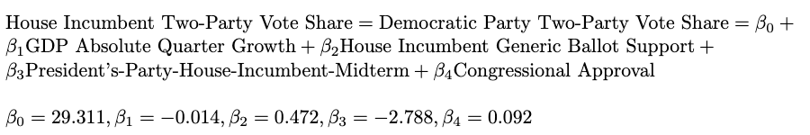

This is blog post #8 (the final one!) in a series of analytical posts in lieu of the 2022 midterms. This post is affiliated with Gov 1347: Election Analytics, a course at Harvard University in the department of Government.

---
```{r setup, include = FALSE, message = FALSE}
# # Set up
# knitr::opts_chunk$set(echo = TRUE)
# library(tidyverse)
# library(janitor)
# library(readr)
# library(stargazer)
# library(usmap)
# library(rmapshaper)
# library(sf)
# library(insight)
# library(scales)
# 
# expert_ratings <- read_csv("expert_rating.csv")
# historical_results <- read_csv("historical_results.csv")
# df <- read_csv("econ_mid_genball_results.csv")
# d2022 <- read_csv("house_cands.csv")
# cook <- read_csv("cook.csv")
# inside <- read_csv("inside_elections.csv")

```

# Overview
Welcome to the final election forecasting update of this election cycle! It's been a long journey, but alas, we are one day out from Election Day. In today's blog post, I'm going to present my final predictions in detail, which will involve model formulas, model descriptions, model cofficients, model interpretations, model validation, prediction confidence intervals, and visualizations. 

# National Model
Starting in [week 2](https://vivian-1372.github.io/Election-Analytics/post/2022-09-19-local-and-national-economy/), I wanted to build out a good national model with a mix of fundamental variables to predict the national two-party vote shares of the parties. 

## Model Details



## National Predictions

# District Models

## Model Details

## District Predictions

```{r}
# 
# historical_results %>%
#   group_by(year) %>%
#   summarize(count = n())
# 
# expert_ratings %>%
#   group_by(year) %>%
#   summarize(count = n()) 
```

```{r}
# expert_ratings$district <- as.numeric(expert_ratings$district)
# df$district_num <- as.numeric(df$district_num)
# df <- df %>%
#   rename(district = district_num)
# 
# district_data <- expert_ratings %>% 
#   filter(year != 2022) 
# 
# newdf <- left_join(df, expert_ratings, by = c("year", "state", "district"))
# newdf <- drop_na(newdf)
# 
# sds = unique(historical_results$district_id)
# models <- list()
# models2 <- list()
# r2 <- c()
# r22 <- c()
# preds <- c()
# for (sd in sds){
#   temp <- historical_results %>%
#     filter(district_id == sd)
#   
#   if (nrow(temp) > 0)
#   {
#     m <- glm(demWin ~ incumbent, data = temp, family = binomial(link = logit))
#     models[[length(models)+1]] <- m
#   
#     r2 <- c(r2, mcf_r_squared = map_dbl(m, ~with(summary(m), 1 - deviance/null.deviance)))
#   }
#   #Make a 2022 prediction and append to list
#   # preds <- c(preds, predict(m2, 2022data))
# }
# 
# summary(glm(demWin))
# mean(r2, na.rm = TRUE)
# hist(r2)
# median(r2)
```


```{r}
# expert_ratings$district <- as.numeric(expert_ratings$district)
# historical_results$district <- as.numeric(df$district_num)
# df <- df %>%
#   rename(district = district_num)
# 
# district_data <- expert_ratings %>% 
#   filter(year != 2022) 
# 
# newdf <- left_join(historical_results, expert_ratings, by = c("year", "state", "district"))
# newdf <- drop_na(newdf)
# 
# sds = unique(historical_results$district_id)
# models <- list()
# models2 <- list()
# r2 <- c()
# r22 <- c()
# preds <- c()
# for (sd in sds){
#   temp <- newdf %>%
#     filter(district_id == sd)
#   
#   if (nrow(temp) > 0)
#   {
#     m <- lm(dem_votes_major_percent ~ incumbent + avg_rating, data = temp)
#     models[[length(models)+1]] <- m
#   
#     r2 <- c(r2, summary(m)$r.squared)
#   }
#   #Make a 2022 prediction and append to list
#   # preds <- c(preds, predict(m2, 2022data))
# }
# 
# mean(r2, na.rm = TRUE)
```

```{r YAO district models for competitive ones, include = FALSE}
# Selecting columns
# 
# 
# avg_ratings <- expert_ratings %>% 
#   select(year, state, district, avg_rating)
# 
# historical_results <- historical_results %>% 
#   mutate(incumbent = case_when(DemStatus == "Incumbent" ~ 1, T ~ 0), demWin = case_when(WinnerParty == "D" ~ 1, T ~ 0), open = case_when((DemStatus == "Challenger" & RepStatus == "Challenger") ~ 1, T ~ 0))
#   
# 
# hist_data <- historical_results %>% 
#   filter(year != 2022) %>% 
#   # left join as there aren't ratings for every district
#   group_by(state, district) %>% 
#   filter(n() > 1) %>% # Filtering out single data rows
#   group_nest() %>% 
#   mutate(data = map(data, ~unnest(., cols = c())))
# 
# hist_test_data <- house_cands_22 %>% 
#   group_by(state, district) %>% 
#   group_nest() %>% 
#   mutate(data = map(data, ~unnest(., cols = c())))
# 
# models <- hist_data %>% 
#   mutate(model = map(data, ~lm(dem_vote_major_percent ~ incumbent, 
#                                   data = .x))) %>% 
#   select(-data)
# 
# model_results <- models %>% 
#   mutate(RS = map_dbl(model, ~summary(.x)$r.squared), ARS = map_dbl(model, ~summary(.x)$adj.r.squared))
# 
# pred_2022 <- hist_test_data %>%
#   # inner join as there may not be historical models for some districts
#   inner_join(models, by = c("state", "district")) %>% 
#   mutate(pred = map_dbl(.x = model, .y = data, ~predict(object = .x, newdata = as.data.frame(.y)))) %>%
#   select(state, district, pred)
# 
# hist(model_results$RS)
# mean(model_results$RS, na.rm = TRUE)
# mean(model_results$ARS, na.rm = TRUE)
# 
# #^^ those should be near 1, no???? 
# 
# testt <- historical_results %>%
#   mutate(wrong = case_when((demWin == 1 & incumbent == 1) ~ 1, T ~ 0), win = case_when((demWin == 1 & incumbent == 0) ~ 1, T ~ 0), rw = case_when((demWin == 0 & incumbent == 1) ~ 1, T ~ 0)) %>%
#   summarize(count = n(wrong))
# 
# sum(testt$wrong)
# sum(testt$win)
# sum(testt$rw)
# sum(testt$incumbent)
# 
# testt %>%
#   group_by(demWin, incumbent, open) %>%
#   summarize(count =n())

#--------------
# Joining the data and nesting by state and district
# train_data <- avg_ratings %>% 
#   filter(year != 2022) %>% 
#   # left join as there aren't ratings for every district
#   left_join(historical_results, by = c("year", "state", "district"))  %>%
#   group_by(state, district) %>% 
#   filter(n() > 1) %>% # Filtering out single data rows
#   group_nest() %>% 
#   mutate(data = map(data, ~unnest(., cols = c())))
# 
# d2022$district <- as.numeric(d2022$district )
# d2022 <- d2022 %>%
#   filter(cand_party == "Democratic") %>%
#   distinct()
# 
# test_data <- avg_ratings %>% 
#   left_join(d2022, by = c("state", "district")) %>%
#   filter(year == 2022) %>% 
#   group_by(state, district) %>% 
#   group_nest() %>% 
#   mutate(data = map(data, ~unnest(., cols = c())))
# 
# # Building TERRIBLE models
# models <- train_data %>% 
#   mutate(model = map(data, ~lm(dem_votes_major_percent ~ avg_rating + incumbent, 
#                                   data = .x))) %>% 
#   select(-data)
# 
# # Extracting TERRIBLE model results
# model_results <- models %>% 
#   mutate(RS = map_dbl(model, ~summary(.x)$r.squared), ARS = map_dbl(model, ~summary(.x)$adj.r.squared))
# 
# # Predicting 2022 with a TERRIBLE model
# pred_2022 <- test_data %>%
#   # inner join as there may not be historical models for some districts
#   inner_join(models, by = c("state", "district")) %>% 
#   mutate(pred = map(.x = model, .y = data, ~predict(object = .x, newdata = as.data.frame(.y), interval = 'confidence'))) %>%
#   select(state, district, pred)
# 
# hist(model_results$RS)
# mean(model_results$RS, na.rm = TRUE)
# mean(model_results$ARS, na.rm = TRUE)
# length(model_results)
# 
# pred_2022 %>%
#   unnest_wider(col = pred) %>%
#   distinct() %>%
#   mutate(winner = case_when(...1 >= 50 ~ "Democrat", T ~ "Republican")) %>%
#   select(state, district, ...1, ...3, ...5, winner) %>%
#   rename("prediction" = ...1, "lower" = ...3, "upper" = ...5)
# 
# d2022
```


```{r district models for non-competitive ones; just use incumbent?, include = FALSE}

## use expert ratings and incumbency for all 435, see if it agrees with my all expert preds + incumb model for the competitive ones. 
# 
# cook
# cook %>%
#   group_by(year) %>%
#   summarize(count = n())
# 
# 
# 
# newdf <- left_join(historical_results, expert_ratings, by = c("year", "state", "district"))
# newdf <- drop_na(newdf)
# 
# sds = unique(historical_results$district_id)
# models <- list()
# models2 <- list()
# r2 <- c()
# r22 <- c()
# preds <- c()
# for (sd in sds){
#   temp <- newdf %>%
#     filter(district_id == sd)
#   
#   if (nrow(temp) > 0)
#   {
#     m <- lm(dem_votes_major_percent ~ incumbent, data = temp)
#     models[[length(models)+1]] <- m
#   
#     r2 <- c(r2, summary(m)$r.squared)
#   }
#   #Make a 2022 prediction and append to list
#   # preds <- c(preds, predict(m2, 2022data))
# }
# 
# hist(r2)
# mean(r2, na.rm = TRUE)

```

```{r district models with ALL districts + expert preds - turnout, include = FALSE}
# expert_ratings$district <- as.numeric(expert_ratings$district)
# # df$district_num <- as.numeric(df$district_num)
# # df <- df %>%
# #   rename(district = district_num)
# 
# district_data <- expert_ratings %>% 
#   filter(year != 2022) 
# 
# newdf <- left_join(df, expert_ratings, by = c("year", "state", "district"))
# 
# newdff <- df %>% 
#     full_join(expert_ratings %>% filter(year < 2022 & year > 2010), by = c("year", "state", "district")) #%>%
#     #mutate_if(is.numeric, function(x) replace_na(x, 3.5))
# 
# sum(is.na(newdff$avg_rating))
# 
# newdff$avg_rating[is.na(newdff$avg_rating)] <- mean(newdff$avg_rating, na.rm = TRUE)
# 
# newdf <- drop_na(newdf)
# 
# sds = unique(house_cands_22$st_cd_fips)
# models <- list()
# r2 <- c()
# preds <- c()
# for (sd in sds){
#   # Filter for dataframe with just district sd
#   temp <- newdff %>%
#     filter(st_cd_fips == sd)
#   
#   # Fit linear model for dem two-party vote-share
#   if (nrow(temp) > 0)
#   {
#     m <- lm(DemVotesMajorPercent ~ average_support + incumb + avg_rating, data = temp)
#     models[[length(models)+1]] <- m
#   
#   # Find r^2 and add to list of r^squareds
#     r2 <- c(r2, summary(m)$adj.r.squared)
#   }
# 
#     
#   
#   # Make a 2022 prediction and append to list
#   # new_data <- turnout22 %>%
#   #   filter(st_cd_fips == sd) %>%
#   #   rename(turnout = historical_turnout_by_district)
#   # preds <- c(preds, predict(m, new_data))
# }
# 
# hist(r2, breaks = 50)
# mean(r2, na.rm = TRUE)

```


```{r}
#national model... expert prediction? 
# need data for this
# nat_model_updated_seats <- lm(seats ~ GDP_growth_pct + DSPIC_change_pct + GDP_growth_qt + 
#                pp_generic_ballot + midterm_pres_party_inc_party + expert_prediction, data = nat_model_data)

```
## New Forecast
Include confidence intervals for predictions !! 

---
**References**

[1] 
